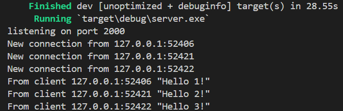
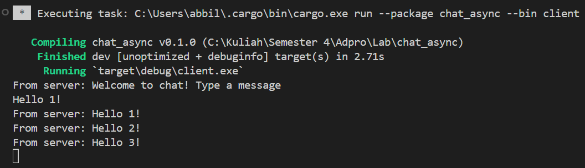
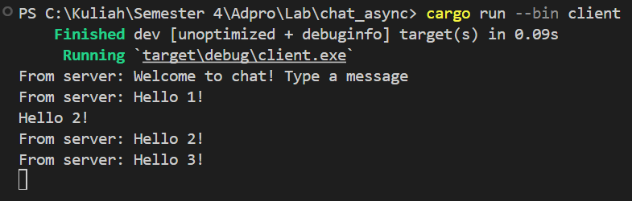
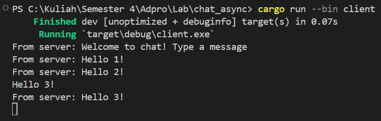
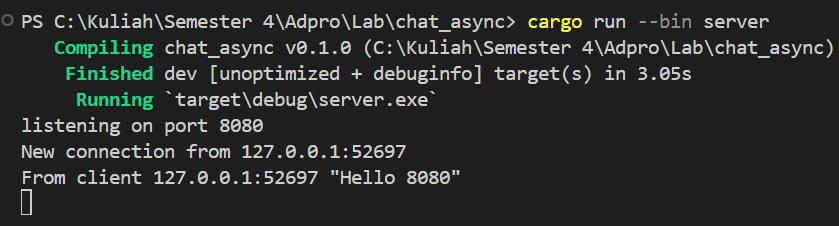
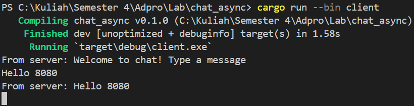
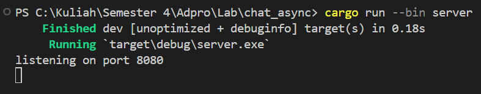
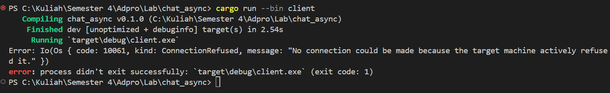

# Tutorial-10
---
#### Nama: Abbilhaidar Farras Zulfikar
#### NPM: 2206026012
#### Kelas: Adpro A
---
### Refleksi
#### 2.1. Original code of broadcast chat.
Server Side  
  
Client 1 Side  
  
Client 2 Side  
  
Client 3 Side  
  
Setelah server dijalankan dan setiap client (ada 3) dijalankan, dari output di atas dapat terlihat bahwa setiap client dan juga server menerima siaran obrolan dari setiap client. Setiap kali seorang client mengetikkan pesan di baris perintah, string tersebut akan dikirim ke server dan server akan terus mengirimkannya ke semua client yang terhubung dengannya.  

#### 2.2. Modifying the websocket port
Ketika client dan server memiliki port yang sama misal 8080, aplikasi akan berjalan dengan lancar seperti sebelumnya, seperti yang terlihat pada gambar di bawah ini.  
  
  

Namun, jika misalnya kita hanya mengubah salah satu port, misalnya port server menjadi 8080 dan port client tetap 2000, maka akan terjadi error pada client karena menurut client port tersebut tidak memiliki koneksi dan program akan crash saat dijalankan dalam foto di bawah ini.  
  
  